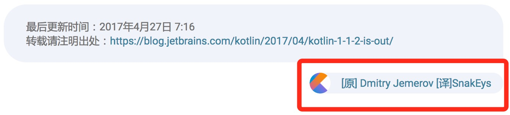

###  博客翻译计划

Kotliner.cn 计划同步翻译 Kotlin 官方博客，以下是经过处理的原文以及经过谷歌翻译的译文，如果愿意参加到翻译当中，请加 QQ 群讨论：162452394，或关注微信公众号 Kotlin 获取最新消息。


### 注意事项

* 翻译时直接修改对应译文，不要修改格式。
* 如需在发布后接受打赏，可以将 reward 设置为 true，并且提供微信和支付宝二维码图片的地址（可以外链，也可以直接上传到本仓库 /assets/文章名/ 目录，地址写绝对路径，比如 /assets/文章名/wechat.png）。
* 4.27 新增译者展示，将你的名字和主页地址写入文章开头的属性，博客中会直接展示，下面是个例子：

  ```
  translator: SnakEys
  translator_url: https://github.com/SnakeEys
  ```

  展示的效果：

  

### 文章列表

| 标题                                       | 发表时间                | 译文地址                                     | 译者                                       | 发布地址                                     |
| -------------------------------- | ------------------- | ---------------------------------------- | --------------------------------- | ---------------------------------------- |
| [Kotlin/Native v0.5 released: calling Kotlin from Swift and C, LLVM 5 and more](original/Kotlin%20Native%20v0.5%20released%20%20calling%20Kotlin%20from%20Swift%20and%20C%2C%20LLVM%205%20and%20more.md) | 2017-12-19 17:16:00 | [译文](translated/Kotlin%20Native%20v0.5%20released%20%20calling%20Kotlin%20from%20Swift%20and%20C%2C%20LLVM%205%20and%20more.md) | | |
| [Webinar recording: Developing Multiplatform Projects in Kotlin 1.2](original/Webinar%20recording%20%20Developing%20Multiplatform%20Projects%20in%20Kotlin%201.2.md) | 2017-12-11 19:07:00 | [译文](translated/Webinar%20recording%20%20Developing%20Multiplatform%20Projects%20in%20Kotlin%201.2.md) | | |
| [KotlinConf 2017 Session Recordings and Photos are Here!](original/KotlinConf%202017%20Session%20Recordings%20and%20Photos%20are%20Here!.md) | 2017-12-08 04:26:00 | [译文](translated/KotlinConf%202017%20Session%20Recordings%20and%20Photos%20are%20Here!.md) | | |
| [Kotlin 1.2 Released: Sharing Code between Platforms](original/Kotlin%201.2%20Released%20%20Sharing%20Code%20between%20Platforms.md) | 2017-11-28 19:52:00 | [译文](translated/Kotlin%201.2%20Released%20%20Sharing%20Code%20between%20Platforms.md) | [pye52](https://githut.com/pye52) | |
| [Kotlin/Native v0.4 released: Objective-C interop, WebAssembly and more](original/Kotlin%20Native%20v0.4%20released%20%20Objective-C%20interop%2C%20WebAssembly%20and%20more.md) | 2017-11-16 15:26:00 | [译文](translated/Kotlin%20Native%20v0.4%20released%20%20Objective-C%20interop%2C%20WebAssembly%20and%20more.md) | | |
| [Kotlin 1.1.60 is out](original/Kotlin%201.1.60%20is%20out.md) | 2017-11-13 14:07:00 | [译文](translated/Kotlin%201.1.60%20is%20out.md) | [pye52](https://githut.com/pye52) | [[译]Kotlin 1.1.60 is out](https://blog.kotliner.cn/2017/11/13/Kotlin%201.1.60%20is%20out/) |
| [Kotlin Native IDE Support Preview](original/Kotlin%20Native%20IDE%20Support%20Preview.md) | 2017-11-03 19:44:00  | [译文](translated/Kotlin%20Native%20IDE%20Support%20Preview.md) |[SnakEys](https://github.com/SnakeEys)| |
| [KotlinConf Keynote Recap](original/KotlinConf%20Keynote%20Recap.md) | 2017-11-02 13:51:00  | [译文](translated/KotlinConf%20Keynote%20Recap.md) | [SnakEys](https://github.com/SnakeEys) | [[译]KotlinConf Keynote Recap](https://blog.kotliner.cn/2017/11/02/KotlinConf%20Keynote%20Recap/) |
| [Kotlin 1.2 Beta2 is out](original/Kotlin%201.2%20Beta2%20is%20out.md) | 2017-10-19 06:43:00  | [译文](translated/Kotlin%201.2%20Beta2%20is%20out.md) |[SnakEys](https://github.com/SnakeEys)  | [[译]Kotlin 1.2 Beta2 is out](https://blog.kotliner.cn/2017/10/19/Kotlin%201.2%20Beta2%20is%20out/) |
| [Kotlin Census 2017](original/Kotlin%20Census%202017.md) | 2017-10-18 11:55:00 | [译文](translated/Kotlin%20Census%202017.md) | [pye52](https://githut.com/pye52) | [[译]Kotlin Census 2017](https://blog.kotliner.cn/2017/10/18/Kotlin%20Census%202017/) |
| [Kotlin 1.2 Beta is out](original/Kotlin%201.2%20Beta%20is%20out.md) | 2017-09-29 06:51:00  | [译文](translated/Kotlin%201.2%20Beta%20is%20out.md) | [pye52](https://githut.com/pye52) | [[译]Kotlin 1.2 Beta is out](https://blog.kotliner.cn/2017/09/29/Kotlin%201.2%20Beta%20is%20out/) |
| [Kotlin 1.1.50 is out](original/Kotlin%201.1.50%20is%20out.md) | 2017-09-22 11:13:00 | [译文](translated/Kotlin%201.1.50%20is%20out.md) |[SnakEys](https://github.com/SnakeEys) | [[译]Kotlin 1.1.50 is out](https://blog.kotliner.cn/2017/09/22/Kotlin%201.1.50%20is%20out/) |
| [KotlinConf - New Workshop and Community Event by JetBrains and Realm](original/KotlinConf%20-%20New%20Workshop%20and%20Community%20Event%20by%20JetBrains%20and%20Realm.md) | 2017-09-05 12:51:00 | [译文](translated/KotlinConf%20-%20New%20Workshop%20and%20Community%20Event%20by%20JetBrains%20and%20Realm.md) |[SnakEys](https://github.com/SnakeEys) | [[译]KotlinConf – New Workshop and Community Event by JetBrains and Realm](https://blog.kotliner.cn/2017/09/05/KotlinConf%20-%20New%20Workshop%20and%20Community%20Event%20by%20JetBrains%20and%20Realm/) |
| [Kotlin 1.1.4 is out](original/Kotlin%201.1.4%20is%20out.md) | 2017-08-15 03:38:00 | [译文](translated/Kotlin%201.1.4%20is%20out.md) |[SnakEys](https://github.com/SnakeEys) | [[译]Kotlin 1.1.4 is out](https://blog.kotliner.cn/2017/08/15/Kotlin%201.1.4%20is%20out/) |
| [Kotlin 1.2 M2 is out](original/Kotlin%201.2%20M2%20is%20out.md) | 2017-08-09 10:56:00  | [译文](translated/Kotlin%201.2%20M2%20is%20out.md) | [pye52](https://githut.com/pye52) | [[译]Kotlin 1.2 M2 is out](https://blog.kotliner.cn/2017/08/09/Kotlin%201.2%20M2%20is%20out/) |
| [Kotlin Workshop Material for you to use](original/Kotlin%20Workshop%20Material%20for%20you%20to%20use.md) | 2017-07-27 05:36:00 | [译文](translated/Kotlin%20Workshop%20Material%20for%20you%20to%20use.md) | [pye52](https://githut.com/pye52) | [[译]Kotlin Workshop Material for you to use](https://blog.kotliner.cn/2017/07/27/Kotlin%20Workshop%20Material%20for%20you%20to%20use/) |
| [KotlinConf – Speaker List Announced](original/KotlinConf%20-%20Speaker%20List%20Announced.md)| 2017-07-17 07:53:00 | [译文](translated/KotlinConf%20-%20Speaker%20List%20Announced.md) | [pye52](https://githut.com/pye52) | [[译]KotlinConf – Speaker List Announced](https://blog.kotliner.cn/2017/07/17/KotlinConf%20-%20Speaker%20List%20Announced/) |
| [Early access program for Kotlin 1.2 has been started](original/Early%20access%20program%20for%20Kotlin%201.2%20has%20been%20started.md) | 2017-06-27 14:45:00 | [译文](translated/Early%20access%20program%20for%20Kotlin%201.2%20has%20been%20started.md) | [DemoJameson](http://www.demojameson.com) | [[译]Kotlin 1.2 EAP（Early Access Program）版本发布](https://blog.kotliner.cn/2017/06/27/Early%20access%20program%20for%20Kotlin%201.2%20has%20been%20started/) |
| [Kotlin 1.1.3 is out](original/Kotlin%201.1.3%20is%20out.md) | 2017-06-23 13:19:00 | [译文](translated/Kotlin%201.1.3%20is%20out.md) | [SnakEys](https://github.com/SnakeEys) | [[译]Kotlin 1.1.3 is out](https://blog.kotliner.cn/2017/06/23/Kotlin%201.1.3%20is%20out/) |
| [Kotlin Native v0.3 is out](original/Kotlin%20Native%20v0.3%20is%20out.md) | 2017-06-22 13:41:00 | [译文](translated/Kotlin%20Native%20v0.3%20is%20out.md) |[SnakEys](https://github.com/SnakeEys) | [[译]Kotlin/Native v0.3 is out](https://blog.kotliner.cn/2017/06/22/Kotlin%20Native%20v0.3%20is%20out/)] |
| [Kotlin Future Features Survey Results](original/Kotlin%20Future%20Features%20Survey%20Results.md) | 2017-06-13 14:24:00 | [译文](translated/Kotlin%20Future%20Features%20Survey%20Results.md) | [pye52](https://githut.com/pye52) | [[译]Kotlin Future Features Survey Results](https://blog.kotliner.cn/2017/06/13/Kotlin%20Future%20Features%20Survey%20Results/) |
| [Kotlin on Android. Now official](original/Kotlin%20on%20Android.%20Now%20official.md) | 2017-05-17 22:33:00 | [译文](translated/Kotlin%20on%20Android.%20Now%20official.md)   | [SnakEys](https://github.com/SnakeEys)   |     [[译]Google 力挺 Kotlin，这是怎么回事！](http://www.kotliner.cn/2017/05/18/Kotlin-on-Android-Now-official/)                                  |
| [New Style for User Groups](original/New%20Style%20for%20User%20Groups.md) | 2017-05-16 17:52:00 | [译文](translated/New%20Style%20for%20User%20Groups.md) |    [pye52](https://githut.com/pye52)       | [[译]New Style for User Groups](https://blog.kotliner.cn/2017/05/16/New%20Style%20for%20User%20Groups/) |
| [Kotlin_Native v0.2 is out](original/Kotlin_Native%20v0.2%20is%20out.md) | 2017-05-12 11:08:00 | [译文](translated/Kotlin_Native%20v0.2%20is%20out.md) |      [bennyhuo](https://github.com/enbandari)              |      [[译]Kotlin/Native v0.2 发布啦](http://www.kotliner.cn/2017/05/12/Kotlin_Native%20v0.2%20is%20out/)          |
| [Kotlin 1.1.2 is out](original/Kotlin%201.1.2%20is%20out.md) | 2017-04-25 21:19:00 | [译文](translated/Kotlin%201.1.2%20is%20out.md) | [SnakEys](https://github.com/SnakeEys)   | [[译]Kotlin 1.1.2 is out](https://www.kotliner.cn/2017/04/25/Kotlin%201.1.2%20is%20out/) |
| [Use Kotlin with npm, webpack and react](original/Use%20Kotlin%20with%20npm%2C%20webpack%20and%20react.md) | 2017-04-18 15:23:00 | [译文](translated/Use%20Kotlin%20with%20npm%2C%20webpack%20and%20react.md) | [Liu PeiPei](https://github.com/lsanotes) | [[译]Use Kotlin with npm, webpack and react](https://www.kotliner.cn/2017/04/18/Use%20Kotlin%20with%20npm,%20webpack%20and%20react/) |
| [Kotlin 1.1 Event Report](original/Kotlin%201.1%20Event%20Report.md) | 2017-04-06 23:21:00 | [译文](translated/Kotlin%201.1%20Event%20Report.md) | [Liu PeiPei](https://github.com/lsanotes) | [[译]Kotlin 1.1 Event Report](https://www.kotliner.cn/2017/04/06/Kotlin%201.1%20Event%20Report/) |
| [Kotlin 1.1 is also for Android Developers](original/Kotlin%201.1%20is%20also%20for%20Android%20Developers.md) | 2017-04-05 16:13:00 | [译文](translated/Kotlin%201.1%20is%20also%20for%20Android%20Developers.md) | [DemoJameson](http://www.demojameson.com) | [[译]Kotlin 1.1 也适用于 Android 开发者](https://www.kotliner.cn/2017/04/05/Kotlin%201.1%20is%20also%20for%20Android%20Developers/) |
| [Kotlin_Native Tech Preview Kotlin without a VM](original/Kotlin_Native%20Tech%20Preview%20Kotlin%20without%20a%20VM.md) | 2017-04-04 14:42:00 | [译文](translated/Kotlin_Native%20Tech%20Preview%20Kotlin%20without%20a%20VM.md) | [SnakEys](https://github.com/SnakeEys)   | [[译]Kotlin_Native Tech Preview Kotlin without a VM](http://www.kotliner.cn/2017/04/18/Use%20Kotlin%20with%20npm,%20webpack%20and%20react/) |
| [Kotlin 1.1 Event in Your City](original/Kotlin%201.1%20Event%20in%20Your%20City.md) | 2017-03-21 21:51:00 | [译文](translated/Kotlin%201.1%20Event%20in%20Your%20City.md) | [SnakEys](https://github.com/SnakeEys)   | [[译]Kotlin 1.1 Event in Your City](https://www.kotliner.cn/2017/03/21/Kotlin%201.1%20Event%20in%20Your%20City/) |
| [Kotlin 1.0.7 is out](original/Kotlin%201.0.7%20is%20out.md) | 2017-03-15 22:21:00 | [译文](translated/Kotlin%201.0.7%20is%20out.md) |    [pye52](https://github.com/pye52)         |  [[译]Kotlin 1.0.7 is out](http://www.kotliner.cn/2017/03/15/Kotlin%201.0.7%20is%20out/)                                        |
| [Announcing KotlinConf](original/Announcing%20KotlinConf.md) | 2017-03-14 21:57:00 | [译文](translated/Announcing%20KotlinConf.md) |                                          [SnakEys](https://github.com/SnakeEys)    |   |
| [Kotlin 1.1.1 is out](original/Kotlin%201.1.1%20is%20out.md) | 2017-03-14 20:29:00 | [译文](translated/Kotlin%201.1.1%20is%20out.md) | [SnakEys](https://github.com/SnakeEys)   | [[译]Kotlin 1.1.1 is out](https://www.kotliner.cn/2017/03/14/Kotlin%201.1.1%20is%20out/) |
| [Kotlin 1.1 Event](original/Kotlin%201.1%20Event.md) | 2017-03-06 17:43:00 | [译文](translated/Kotlin%201.1%20Event.md) | [SnakEys](https://github.com/SnakeEys)   | [[译文]Kotlin 1.1 Event](http://www.kotliner.cn/2017/03/06/Kotlin%201.1%20Event/) |
| [Kotlin 1.1 Released with JavaScript Support, Coroutines and more](original/Kotlin%201.1%20Released%20with%20JavaScript%20Support%2C%20Coroutines%20and%20more.md) | 2017-03-01 17:12:00 | [译文](translated/Kotlin%201.1%20Released%20with%20JavaScript%20Support%2C%20Coroutines%20and%20more.md) | [SnakEys](https://github.com/SnakeEys)   | [[译文]Kotlin 1.1 发布啦！JavaScript，Coroutine 还有更多你想要的](http://www.kotliner.cn/2017/03/01/Kotlin%201.1%20Released%20with%20JavaScript%20Support,%20Coroutines%20and%20more/) |
| [Kotlin 1.1 Release Candidate is Here](original/Kotlin%201.1%20Release%20Candidate%20is%20Here.md) | 2017-02-17 13:37:00 | [译文](translated/Kotlin%201.1%20Release%20Candidate%20is%20Here.md) | [ahong222](https://github.com/ahong222)  | [[译]Kotlin 1.1 候选版本来啦](http://www.kotliner.cn/2017/02/17/Kotlin%201.1%20Release%20Candidate%20is%20Here/) |
| [Our first book about Kotlin is out](original/Our%20first%20book%20about%20Kotlin%20is%20out.md) | 2017-02-10 20:00:00 | [译文](translated/Our%20first%20book%20about%20Kotlin%20is%20out.md) |                                          |                                          |
| [Kotlin 1.1 Beta 2 is here](original/Kotlin%201.1%20Beta%202%20is%20here.md) | 2017-02-02 23:24:00 | [译文](translated/Kotlin%201.1%20Beta%202%20is%20here.md) |                                          |                                          |
| [Announcing the Support Program for Kotlin User Groups and Events](original/Announcing%20the%20Support%20Program%20for%20Kotlin%20User%20Groups%20and%20Events.md) | 2017-01-30 21:42:00 | [译文](translated/Announcing%20the%20Support%20Program%20for%20Kotlin%20User%20Groups%20and%20Events.md) |                                          |                                          |
| [Kotlin 1.1 What’s coming in the standard library](original/Kotlin%201.1%20What%E2%80%99s%20coming%20in%20the%20standard%20library.md) | 2017-01-25 00:15:00 | [译文](translated/Kotlin%201.1%20What%E2%80%99s%20coming%20in%20the%20standard%20library.md) |                                          |                                          |
| [Kotlin 1.1 Beta Is Here!](original/Kotlin%201.1%20Beta%20Is%20Here%21.md) | 2017-01-19 13:51:00 | [译文](translated/Kotlin%201.1%20Beta%20Is%20Here%21.md) |                                          |                                          |
| [Kotlin 1.0.6 is here!](original/Kotlin%201.0.6%20is%20here%21.md) | 2016-12-27 20:11:00 | [译文](translated/Kotlin%201.0.6%20is%20here%21.md) |                                          |                                          |
| [Kotlin 1.1-M04 is here!](original/Kotlin%201.1-M04%20is%20here%21.md) | 2016-12-21 00:12:00 | [译文](translated/Kotlin%201.1-M04%20is%20here%21.md) |                                          |                                          |
| [Kotlin 1.1-M03 is here!](original/Kotlin%201.1-M03%20is%20here%21.md) | 2016-11-24 12:50:00 | [译文](translated/Kotlin%201.1-M03%20is%20here%21.md) |                                          |                                          |
| [Kotlin Night in London Recordings](original/Kotlin%20Night%20in%20London%20Recordings.md) | 2016-11-15 14:44:00 | [译文](translated/Kotlin%20Night%20in%20London%20Recordings.md) |                                          |                                          |
| [Kotlin 1.0.5 is here](original/Kotlin%201.0.5%20is%20here.md) | 2016-11-08 22:04:00 | [译文](translated/Kotlin%201.0.5%20is%20here.md) |                                          |                                          |
| [Kotlin 1.1-M02 is here!](original/Kotlin%201.1-M02%20is%20here%21.md) | 2016-10-20 14:04:00 | [译文](translated/Kotlin%201.1-M02%20is%20here%21.md) |                                          |                                          |
| [Kotlin Night in London](original/Kotlin%20Night%20in%20London.md) | 2016-09-28 12:48:00 | [译文](translated/Kotlin%20Night%20in%20London.md) |                                          |                                          |
| [Kotlin 1.0.4 is here](original/Kotlin%201.0.4%20is%20here.md) | 2016-09-22 20:18:00 | [译文](translated/Kotlin%201.0.4%20is%20here.md) |                                          |                                          |
| [Kotlin NetBeans plugin beta is out!](original/Kotlin%20NetBeans%20plugin%20beta%20is%20out%21.md) | 2016-09-19 18:42:00 | [译文](translated/Kotlin%20NetBeans%20plugin%20beta%20is%20out%21.md) |                                          |                                          |
| [Kotlin census call to action](original/Kotlin%20census%20call%20to%20action.md) | 2016-09-01 17:06:00 | [译文](translated/Kotlin%20census%20call%20to%20action.md) |                                          |                                          |
| [Calling on EAPers](original/Calling%20on%20EAPers.md) | 2016-08-04 21:44:00 | [译文](translated/Calling%20on%20EAPers.md) |                                          |                                          |
| [First glimpse of Kotlin 1.1 Coroutines, Type aliases and more](original/First%20glimpse%20of%20Kotlin%201.1%20Coroutines%2C%20Type%20aliases%20and%20more.md) | 2016-07-14 19:01:00 | [译文](translated/First%20glimpse%20of%20Kotlin%201.1%20Coroutines%2C%20Type%20aliases%20and%20more.md) |                                          |                                          |
| [Kotlin 1.0.3 Is Here!](original/Kotlin%201.0.3%20Is%20Here%21.md) | 2016-06-30 18:52:00 | [译文](translated/Kotlin%201.0.3%20Is%20Here%21.md) |                                          |                                          |
| [Kotlin Night in San Francisco Recordings](original/Kotlin%20Night%20in%20San%20Francisco%20Recordings.md) | 2016-06-14 19:32:00 | [译文](translated/Kotlin%20Night%20in%20San%20Francisco%20Recordings.md) |                                          |                                          |
| [Meet the Kotlin Team at Gradle Summit](original/Meet%20the%20Kotlin%20Team%20at%20Gradle%20Summit.md) | 2016-06-13 13:28:00 | [译文](translated/Meet%20the%20Kotlin%20Team%20at%20Gradle%20Summit.md) |                                          |                                          |
| [Kotlin Eclipse Plugin 0.7 Is Here!](original/Kotlin%20Eclipse%20Plugin%200.7%20Is%20Here%21.md) | 2016-06-03 17:48:00 | [译文](translated/Kotlin%20Eclipse%20Plugin%200.7%20Is%20Here%21.md) |                                          |                                          |
| [Gradle Meets Kotlin](original/Gradle%20Meets%20Kotlin.md) | 2016-05-18 06:18:00 | [译文](translated/Gradle%20Meets%20Kotlin.md) |                                          |                                          |
| [Kotlin 1.0.2 is Here](original/Kotlin%201.0.2%20is%20Here.md) | 2016-05-13 13:36:00 | [译文](translated/Kotlin%201.0.2%20is%20Here.md) |                                          |                                          |
| [Kotlin Post-1.0 Roadmap](original/Kotlin%20Post-1.0%20Roadmap.md) | 2016-04-14 16:34:00 | [译文](translated/Kotlin%20Post-1.0%20Roadmap.md) |                                          |                                          |
| [Kotlin Digest 2016.Q1](original/Kotlin%20Digest%202016.Q1.md) | 2016-04-06 19:37:00 | [译文](translated/Kotlin%20Digest%202016.Q1.md) |                                          |                                          |
| [Kotlin’s Android Roadmap](original/Kotlin%E2%80%99s%20Android%20Roadmap.md) | 2016-03-30 16:40:00 | [译文](translated/Kotlin%E2%80%99s%20Android%20Roadmap.md) |                                          |                                          |
| [Kotlin Educational Plugin](original/Kotlin%20Educational%20Plugin.md) | 2016-03-17 18:47:00 | [译文](translated/Kotlin%20Educational%20Plugin.md) |                                          |                                          |
| [Kotlin 1.0.1 is Here!](original/Kotlin%201.0.1%20is%20Here%21.md) | 2016-03-16 23:54:00 | [译文](translated/Kotlin%201.0.1%20is%20Here%21.md) |                                          |                                          |
| [Kotlin 1.0 Released Pragmatic Language for JVM and Android](original/Kotlin%201.0%20Released%20Pragmatic%20Language%20for%20JVM%20and%20Android.md) | 2016-02-15 16:57:00 | [译文](translated/Kotlin%201.0%20Released%20Pragmatic%20Language%20for%20JVM%20and%20Android.md) |                                          |                                          |
| [Kotlin 1.0 Release Candidate is Out!](original/Kotlin%201.0%20Release%20Candidate%20is%20Out%21.md) | 2016-02-04 18:39:00 | [译文](translated/Kotlin%201.0%20Release%20Candidate%20is%20Out%21.md) |                                          |                                          |
| [Kotlin Digest 2015](original/Kotlin%20Digest%202015.md) | 2016-01-19 15:53:00 | [译文](translated/Kotlin%20Digest%202015.md) |                                          |                                          |
| [Kotlin 1.0 Beta 4 is Out!](original/Kotlin%201.0%20Beta%204%20is%20Out%21.md) | 2015-12-22 22:25:00 | [译文](translated/Kotlin%201.0%20Beta%204%20is%20Out%21.md) |                                          |                                          |
| [Learn Kotlin with “Advent of Code”](original/Learn%20Kotlin%20with%20%E2%80%9CAdvent%20of%20Code%E2%80%9D.md) | 2015-12-18 22:08:00 | [译文](translated/Learn%20Kotlin%20with%20%E2%80%9CAdvent%20of%20Code%E2%80%9D.md) | [pye52](https://github.com/pye52)        | [[译]Learn Kotlin with “Advent of Code”](https://www.kotliner.cn/2015/12/18/Learn%20Kotlin%20with%20%E2%80%9CAdvent%20of%20Code%E2%80%9D/) |
| [Kotlin 1.0 Beta 3 is Out!](original/Kotlin%201.0%20Beta%203%20is%20Out%21.md) | 2015-12-07 15:45:00 | [译文](translated/Kotlin%201.0%20Beta%203%20is%20Out%21.md) | [pye52](https://github.com/pye52)        | [[译]Kotlin 1.0 Beta 3 is Out!](http://www.kotliner.cn/2015/12/07/Kotlin%201.0%20Beta%203%20is%20Out!/) |
| [Kotlin Eclipse Plugin 0.5.0](original/Kotlin%20Eclipse%20Plugin%200.5.0.md) | 2015-12-01 15:57:00 | [译文](translated/Kotlin%20Eclipse%20Plugin%200.5.0.md) |                                          |                                          |
| [Contest Go Cross-Platform with Kotlin!](original/Contest%20Go%20Cross-Platform%20with%20Kotlin%21.md) | 2015-11-25 18:17:00 | [译文](translated/Contest%20Go%20Cross-Platform%20with%20Kotlin%21.md) |                                          |                                          |
| [Kotlin 1.0 Beta 2 is Out!](original/Kotlin%201.0%20Beta%202%20is%20Out%21.md) | 2015-11-16 21:01:00 | [译文](translated/Kotlin%201.0%20Beta%202%20is%20Out%21.md) |                                          |                                          |
| [Webinar Recording Functional Programming with Kotlin](original/Webinar%20Recording%20Functional%20Programming%20with%20Kotlin.md) | 2015-11-05 13:21:00 | [译文](translated/Webinar%20Recording%20Functional%20Programming%20with%20Kotlin.md) |                                          |                                          |
| [The Kotlin Language 1.0 Beta is Here!](original/The%20Kotlin%20Language%201.0%20Beta%20is%20Here%21.md) | 2015-11-02 18:44:00 | [译文](translated/The%20Kotlin%20Language%201.0%20Beta%20is%20Here%21.md) |                                          |                                          |
| [Kotlin 1.0 Beta Candidate is Out!](original/Kotlin%201.0%20Beta%20Candidate%20is%20Out%21.md) | 2015-10-22 16:54:00 | [译文](translated/Kotlin%201.0%20Beta%20Candidate%20is%20Out%21.md) |                                          |                                          |
| [Join Live Webinar — Functional Programming with Kotlin](original/Join%20Live%20Webinar%20%E2%80%94%20Functional%20Programming%20with%20Kotlin.md) | 2015-10-19 12:43:00 | [译文](translated/Join%20Live%20Webinar%20%E2%80%94%20Functional%20Programming%20with%20Kotlin.md) |                                          |                                          |
| [Kotlin M14 is out!](original/Kotlin%20M14%20is%20out%21.md) | 2015-10-01 16:16:00 | [译文](translated/Kotlin%20M14%20is%20out%21.md) |                                          |                                          |
| [What’s new in Standard Library M13 and M14](original/What%E2%80%99s%20new%20in%20Standard%20Library%20M13%20and%20M14.md) | 2015-09-28 16:56:00 | [译文](translated/What%E2%80%99s%20new%20in%20Standard%20Library%20M13%20and%20M14.md) |                                          |                                          |
| [Call for Feedback Java Statics, Result Expressions and More](original/Call%20for%20Feedback%20Java%20Statics%2C%20Result%20Expressions%20and%20More.md) | 2015-09-25 18:27:00 | [译文](translated/Call%20for%20Feedback%20Java%20Statics%2C%20Result%20Expressions%20and%20More.md) |                                          |                                          |
| [Kotlin Eclipse Plugin 0.3.0](original/Kotlin%20Eclipse%20Plugin%200.3.0.md) | 2015-09-24 18:58:00 | [译文](translated/Kotlin%20Eclipse%20Plugin%200.3.0.md) |                                          |                                          |
| [Webinar Recording. Quasar Efficient and Elegant Fibers, Channels and Actors](original/Webinar%20Recording.%20Quasar%20Efficient%20and%20Elegant%20Fibers%2C%20Channels%20and%20Actors.md) | 2015-09-21 13:40:00 | [译文](translated/Webinar%20Recording.%20Quasar%20Efficient%20and%20Elegant%20Fibers%2C%20Channels%20and%20Actors.md) |                                          |                                          |
| [Call for Feedback Upcoming Changes in Kotlin](original/Call%20for%20Feedback%20Upcoming%20Changes%20in%20Kotlin.md) | 2015-09-18 14:06:00 | [译文](translated/Call%20for%20Feedback%20Upcoming%20Changes%20in%20Kotlin.md) |                                          |                                          |
| [Kotlin M13 is out!](original/Kotlin%20M13%20is%20out%21.md) | 2015-09-16 18:29:00 | [译文](translated/Kotlin%20M13%20is%20out%21.md) |                                          |                                          |
| [Join Live Webinar — Quasar and Kotlin](original/Join%20Live%20Webinar%20%E2%80%94%20Quasar%20and%20Kotlin.md) | 2015-09-14 12:00:00 | [译文](translated/Join%20Live%20Webinar%20%E2%80%94%20Quasar%20and%20Kotlin.md) |                                          |                                          |
| [Feedback Request Limitations on Data Classes](original/Feedback%20Request%20Limitations%20on%20Data%20Classes.md) | 2015-09-09 16:26:00 | [译文](translated/Feedback%20Request%20Limitations%20on%20Data%20Classes.md) |                                          |                                          |
| [Modifiers vs Annotations](original/Modifiers%20vs%20Annotations.md) | 2015-08-11 17:47:00 | [译文](translated/Modifiers%20vs%20Annotations.md) |                                          |                                          |
| [Gradle Daemon Support for Faster Compilation](original/Gradle%20Daemon%20Support%20for%20Faster%20Compilation.md) | 2015-08-05 15:20:00 | [译文](translated/Gradle%20Daemon%20Support%20for%20Faster%20Compilation.md) |                                          |                                          |
| [Improving Java Interop Top-Level Functions and Properties](original/Improving%20Java%20Interop%20Top-Level%20Functions%20and%20Properties.md) | 2015-06-23 14:56:00 | [译文](translated/Improving%20Java%20Interop%20Top-Level%20Functions%20and%20Properties.md) |                                          |                                          |
| [Better Annotation Processing Supporting Stubs in kapt](original/Better%20Annotation%20Processing%20Supporting%20Stubs%20in%20kapt.md) | 2015-06-22 15:28:00 | [译文](translated/Better%20Annotation%20Processing%20Supporting%20Stubs%20in%20kapt.md) |                                          |                                          |
| [Kotlin Evolves How to Keep Your Code Up](original/Kotlin%20Evolves%20How%20to%20Keep%20Your%20Code%20Up.md) | 2015-06-17 16:46:00 | [译文](translated/Kotlin%20Evolves%20How%20to%20Keep%20Your%20Code%20Up.md) |                                          |                                          |
| [Kotlin Eclipse Plugin 0.2.0](original/Kotlin%20Eclipse%20Plugin%200.2.0.md) | 2015-06-10 21:26:00 | [译文](translated/Kotlin%20Eclipse%20Plugin%200.2.0.md) |                                          |                                          |
| [Fibers and Actors in Kotlin with Quasar](original/Fibers%20and%20Actors%20in%20Kotlin%20with%20Quasar.md) | 2015-06-04 18:44:00 | [译文](translated/Fibers%20and%20Actors%20in%20Kotlin%20with%20Quasar.md) |                                          |                                          |
| [Kotlin M12 is out!](original/Kotlin%20M12%20is%20out%21.md) | 2015-05-29 16:28:00 | [译文](translated/Kotlin%20M12%20is%20out%21.md) |                                          |                                          |
| [kapt Annotation Processing for Kotlin](original/kapt%20Annotation%20Processing%20for%20Kotlin.md) | 2015-05-21 23:39:00 | [译文](translated/kapt%20Annotation%20Processing%20for%20Kotlin.md) |                                          |                                          |
| [Advanced Features of Anko](original/Advanced%20Features%20of%20Anko.md) | 2015-05-06 10:34:00 | [译文](translated/Advanced%20Features%20of%20Anko.md) |                                          |                                          |
| [Anko 0.6 is Released](original/Anko%200.6%20is%20Released.md) | 2015-04-30 12:31:00 | [译文](translated/Anko%200.6%20is%20Released.md) |                                          |                                          |
| [Try Kotlin in Your Browser New Look and More Features](original/Try%20Kotlin%20in%20Your%20Browser%20New%20Look%20and%20More%20Features.md) | 2015-04-16 20:24:00 | [译文](translated/Try%20Kotlin%20in%20Your%20Browser%20New%20Look%20and%20More%20Features.md) |                                          |                                          |
| [Upcoming Change More Null-safety for Java](original/Upcoming%20Change%20More%20Null-safety%20for%20Java.md) | 2015-04-10 15:34:00 | [译文](translated/Upcoming%20Change%20More%20Null-safety%20for%20Java.md) |                                          |                                          |
| [Upcoming Change Function Types Reform](original/Upcoming%20Change%20Function%20Types%20Reform.md) | 2015-04-09 14:26:00 | [译文](translated/Upcoming%20Change%20Function%20Types%20Reform.md) |                                          |                                          |
| [Announcing Anko for Android](original/Announcing%20Anko%20for%20Android.md) | 2015-04-08 16:20:00 | [译文](translated/Announcing%20Anko%20for%20Android.md) |                                          |                                          |
| [More changes Enum Syntax, Another Deprecation and More](original/More%20changes%20Enum%20Syntax%2C%20Another%20Deprecation%20and%20More.md) | 2015-04-07 13:34:00 | [译文](translated/More%20changes%20Enum%20Syntax%2C%20Another%20Deprecation%20and%20More.md) |                                          |                                          |
| [More Deprecations Coming](original/More%20Deprecations%20Coming.md) | 2015-04-06 12:55:00 | [译文](translated/More%20Deprecations%20Coming.md) |                                          |                                          |
| [Upcoming Change Syntax For Annotations](original/Upcoming%20Change%20Syntax%20For%20Annotations.md) | 2015-04-03 13:13:00 | [译文](translated/Upcoming%20Change%20Syntax%20For%20Annotations.md) |                                          |                                          |
| [Upcoming Feature Deprecations](original/Upcoming%20Feature%20Deprecations.md) | 2015-04-02 13:00:00 | [译文](translated/Upcoming%20Feature%20Deprecations.md) |                                          |                                          |
| [Eclipse Plugin Alpha is Out!](original/Eclipse%20Plugin%20Alpha%20is%20Out%21.md) | 2015-03-31 00:54:00 | [译文](translated/Eclipse%20Plugin%20Alpha%20is%20Out%21.md) |                                          |                                          |
| [Kotlin M11 is Out!](original/Kotlin%20M11%20is%20Out%21.md) | 2015-03-19 17:27:00 | [译文](translated/Kotlin%20M11%20is%20Out%21.md) |                                          |                                          |
| [Follow-up New Class Object Syntax](original/Follow-up%20New%20Class%20Object%20Syntax.md) | 2015-03-14 10:57:00 | [译文](translated/Follow-up%20New%20Class%20Object%20Syntax.md) |                                          |                                          |
| [Upcoming Change “Class Objects” Rethought](original/Upcoming%20Change%20%E2%80%9CClass%20Objects%E2%80%9D%20Rethought.md) | 2015-03-11 16:11:00 | [译文](translated/Upcoming%20Change%20%E2%80%9CClass%20Objects%E2%80%9D%20Rethought.md) |                                          |                                          |
| [MCE2015 Kotlin Session and JetBrains Booth](original/MCE2015%20Kotlin%20Session%20and%20JetBrains%20Booth.md) | 2015-01-15 14:32:00 | [译文](translated/MCE2015%20Kotlin%20Session%20and%20JetBrains%20Booth.md) |                                          |                                          |
| [JavaScript Interop](original/JavaScript%20Interop.md) | 2014-12-24 09:57:00 | [译文](translated/JavaScript%20Interop.md) |                                          |                                          |
| [M10 is out](original/M10%20is%20out.md) | 2014-12-17 15:02:00 | [译文](translated/M10%20is%20out.md)       |                                          |                                          |
| [M9 is here!](original/M9%20is%20here%21.md) | 2014-10-15 18:38:00 | [译文](translated/M9%20is%20here%21.md)    |                                          |                                          |
| [Making Platform Interop even smoother](original/Making%20Platform%20Interop%20even%20smoother.md) | 2014-10-06 13:20:00 | [译文](translated/Making%20Platform%20Interop%20even%20smoother.md) |                                          |                                          |
| [M9 is coming](original/M9%20is%20coming.md) | 2014-10-01 22:10:00 | [译文](translated/M9%20is%20coming.md)     |                                          |                                          |
| [Full-Day Kotlin Workshop October 6th in Malmö, Sweden](original/Full-Day%20Kotlin%20Workshop%20October%206th%20in%20Malmö%2C%20Sweden.md) | 2014-08-20 14:53:00 | [译文](translated/Full-Day%20Kotlin%20Workshop%20October%206th%20in%20Malmö%2C%20Sweden.md) |                                          |                                          |
| [A New Open Source Web Site](original/A%20New%20Open%20Source%20Web%20Site.md) | 2014-07-15 09:00:00 | [译文](translated/A%20New%20Open%20Source%20Web%20Site.md) |                                          |                                          |
| [M8 is out!](original/M8%20is%20out%21.md) | 2014-07-02 00:00:00 | [译文](translated/M8%20is%20out%21.md)     |                                          |                                          |
| [Kotlin gets support for S-expressions](original/Kotlin%20gets%20support%20for%20S-expressions.md) | 2014-04-01 18:33:00 | [译文](translated/Kotlin%20gets%20support%20for%20S-expressions.md) |                                          |                                          |
| [M7 Release Available](original/M7%20Release%20Available.md) | 2014-03-20 00:00:00 | [译文](translated/M7%20Release%20Available.md) |                                          |                                          |
| [Spek – A Specification Framework](original/Spek%20%E2%80%93%20A%20Specification%20Framework.md) | 2014-02-17 17:20:00 | [译文](translated/Spek%20%E2%80%93%20A%20Specification%20Framework.md) |                                          |                                          |
| [M6.2 Available](original/M6.2%20Available.md) | 2013-12-06 15:55:00 | [译文](translated/M6.2%20Available.md)     |                                          |                                          |
| [Catch up with our Kotlin Team at Devoxx Belgium](original/Catch%20up%20with%20our%20Kotlin%20Team%20at%20Devoxx%20Belgium.md) | 2013-11-04 12:36:00 | [译文](translated/Catch%20up%20with%20our%20Kotlin%20Team%20at%20Devoxx%20Belgium.md) |                                          |                                          |
| [Writing Kotlin in the Browser](original/Writing%20Kotlin%20in%20the%20Browser.md) | 2013-10-16 08:00:00 | [译文](translated/Writing%20Kotlin%20in%20the%20Browser.md) |                                          |                                          |
| [How to configure Kotlin in your project](original/How%20to%20configure%20Kotlin%20in%20your%20project.md) | 2013-10-07 14:34:00 | [译文](translated/How%20to%20configure%20Kotlin%20in%20your%20project.md) |                                          |                                          |
| [M6.1 Released](original/M6.1%20Released.md) | 2013-10-03 00:00:00 | [译文](translated/M6.1%20Released.md)      |                                          |                                          |
| [Working with Kotlin in Android Studio](original/Working%20with%20Kotlin%20in%20Android%20Studio.md) | 2013-08-26 18:49:00 | [译文](translated/Working%20with%20Kotlin%20in%20Android%20Studio.md) |                                          |                                          |
| [Kotlin M6 is here!](original/Kotlin%20M6%20is%20here%21.md) | 2013-08-12 21:09:00 | [译文](translated/Kotlin%20M6%20is%20here%21.md) |                                          |                                          |
| [Mixed-Site Variance in Kotlin](original/Mixed-Site%20Variance%20in%20Kotlin.md) | 2013-06-26 12:00:00 | [译文](translated/Mixed-Site%20Variance%20in%20Kotlin.md) |                                          |                                          |
| [“Static constants” in Kotlin](original/%E2%80%9CStatic%20constants%E2%80%9D%20in%20Kotlin.md) | 2013-06-24 12:00:00 | [译文](translated/%E2%80%9CStatic%20constants%E2%80%9D%20in%20Kotlin.md) | [SnakEys](https://github.com/SnakeEys)   | [[译]“Static constants” in Kotlin](https://www.kotliner.cn/2013/06/24/%E2%80%9CStatic%20constants%E2%80%9D%20in%20Kotlin/) |
| [Type-Safe Web with Kotlin](original/Type-Safe%20Web%20with%20Kotlin.md) | 2013-06-17 18:13:00 | [译文](translated/Type-Safe%20Web%20with%20Kotlin.md) |                                          |                                          |
| [Talk @ GeekOUT Tallinn Language Design Trade-Offs (Kotlin and Beyond)](original/Talk%20%40%20GeekOUT%20Tallinn%20Language%20Design%20Trade-Offs%20%28Kotlin%20and%20Beyond%29.md) | 2013-06-10 15:27:00 | [译文](translated/Talk%20%40%20GeekOUT%20Tallinn%20Language%20Design%20Trade-Offs%20%28Kotlin%20and%20Beyond%29.md) |                                          |                                          |
| [Kotlin M5.3 IntelliJ IDEA 13, Delegated Properties and more](original/Kotlin%20M5.3%20IntelliJ%20IDEA%2013%2C%20Delegated%20Properties%20and%20more.md) | 2013-06-06 10:48:00 | [译文](translated/Kotlin%20M5.3%20IntelliJ%20IDEA%2013%2C%20Delegated%20Properties%20and%20more.md) |                                          |                                          |
| [Kotlin M5.2 IntelliJ IDEA 12.1 and Gradle](original/Kotlin%20M5.2%20IntelliJ%20IDEA%2012.1%20and%20Gradle.md) | 2013-04-04 15:00:00 | [译文](translated/Kotlin%20M5.2%20IntelliJ%20IDEA%2012.1%20and%20Gradle.md) |                                          |                                          |
| [The Dot Operator](original/The%20Dot%20Operator.md) | 2013-04-01 10:00:00 | [译文](translated/The%20Dot%20Operator.md) |                                          |                                          |
| [KAnnotator 0.1 is out](original/KAnnotator%200.1%20is%20out.md) | 2013-03-29 14:42:00 | [译文](translated/KAnnotator%200.1%20is%20out.md) |                                          |                                          |
| [Kotlin Session and JetBrains Booth at 33rd Degree Conference](original/Kotlin%20Session%20and%20JetBrains%20Booth%20at%2033rd%20Degree%20Conference.md) | 2013-03-01 09:09:00 | [译文](translated/Kotlin%20Session%20and%20JetBrains%20Booth%20at%2033rd%20Degree%20Conference.md) |                                          |                                          |
| [Kotlin M5.1](original/Kotlin%20M5.1.md) | 2013-02-27 11:03:00 | [译文](translated/Kotlin%20M5.1.md)        |                                          |                                          |
| [“Surround with…” comes to Kotlin](original/%E2%80%9CSurround%20with%E2%80%A6%E2%80%9D%20comes%20to%20Kotlin.md) | 2013-02-26 09:20:00 | [译文](translated/%E2%80%9CSurround%20with%E2%80%A6%E2%80%9D%20comes%20to%20Kotlin.md) |                                          |                                          |
| [Ranges Reloaded](original/Ranges%20Reloaded.md) | 2013-02-06 14:47:00 | [译文](translated/Ranges%20Reloaded.md)    |                                          |                                          |
| [Kotlin M5 is Out!](original/Kotlin%20M5%20is%20Out%21.md) | 2013-02-04 14:30:00 | [译文](translated/Kotlin%20M5%20is%20Out%21.md) |                                          |                                          |
| [An Interview with Andy Selvig, Author of Kara Web Framework](original/An%20Interview%20with%20Andy%20Selvig%2C%20Author%20of%20Kara%20Web%20Framework.md) | 2013-01-31 10:12:00 | [译文](translated/An%20Interview%20with%20Andy%20Selvig%2C%20Author%20of%20Kara%20Web%20Framework.md) |                                          |                                          |
| [Kotlin Skills Matter Events in London, England](original/Kotlin%20Skills%20Matter%20Events%20in%20London%2C%20England.md) | 2013-01-28 09:51:00 | [译文](translated/Kotlin%20Skills%20Matter%20Events%20in%20London%2C%20England.md) |                                          |                                          |
| [Kotlin M4 is Out!](original/Kotlin%20M4%20is%20Out%21.md) | 2012-12-11 09:15:00 | [译文](translated/Kotlin%20M4%20is%20Out%21.md) |                                          |                                          |
| [Kotlin Session at Devoxx, November 16th](original/Kotlin%20Session%20at%20Devoxx%2C%20November%2016th.md) | 2012-11-08 12:09:00 | [译文](translated/Kotlin%20Session%20at%20Devoxx%2C%20November%2016th.md) |                                          |                                          |
| [Dogfooding Kotlin and M3.1](original/Dogfooding%20Kotlin%20and%20M3.1.md) | 2012-10-10 13:06:00 | [译文](translated/Dogfooding%20Kotlin%20and%20M3.1.md) |                                          |                                          |
| [Free Kotlin Webinar on Wednesday, October 10th](original/Free%20Kotlin%20Webinar%20on%20Wednesday%2C%20October%2010th.md) | 2012-09-25 11:06:00 | [译文](translated/Free%20Kotlin%20Webinar%20on%20Wednesday%2C%20October%2010th.md) |                                          |                                          |
| [Kotlin M3 is Out!](original/Kotlin%20M3%20is%20Out%21.md) | 2012-09-20 15:03:00 | [译文](translated/Kotlin%20M3%20is%20Out%21.md) |                                          |                                          |
| [How do you traverse a map?](original/How%20do%20you%20traverse%20a%20map%3F.md) | 2012-09-13 15:00:00 | [译文](translated/How%20do%20you%20traverse%20a%20map%3F.md) |                                          |                                          |
| [Kotlin M2 is Out!](original/Kotlin%20M2%20is%20Out%21.md) | 2012-06-11 09:55:00 | [译文](translated/Kotlin%20M2%20is%20Out%21.md) |                                          |                                          |
| [Kotlin M2 Candidate](original/Kotlin%20M2%20Candidate.md) | 2012-06-04 08:53:00 | [译文](translated/Kotlin%20M2%20Candidate.md) |                                          |                                          |
| [Kotlin M1 is Out!](original/Kotlin%20M1%20is%20Out%21.md) | 2012-04-12 09:37:00 | [译文](translated/Kotlin%20M1%20is%20Out%21.md) |                                          |                                          |
| [Kotlin M1 Candidate](original/Kotlin%20M1%20Candidate.md) | 2012-03-30 14:57:00 | [译文](translated/Kotlin%20M1%20Candidate.md) |                                          |                                          |
| [Contributing to Kotlin (Kontributing)](original/Contributing%20to%20Kotlin%20%28Kontributing%29.md) | 2012-03-01 09:04:00 | [译文](translated/Contributing%20to%20Kotlin%20%28Kontributing%29.md) |                                          |                                          |
| [Kotlin Goes Open Source!](original/Kotlin%20Goes%20Open%20Source%21.md) | 2012-02-14 10:32:00 | [译文](translated/Kotlin%20Goes%20Open%20Source%21.md) |                                          |                                          |
| [Let’s Kode Together!](original/Let%E2%80%99s%20Kode%20Together%21.md) | 2012-02-13 09:07:00 | [译文](translated/Let%E2%80%99s%20Kode%20Together%21.md) |                                          |                                          |
| [The Road Ahead](original/The%20Road%20Ahead.md) | 2012-01-16 10:10:00 | [译文](translated/The%20Road%20Ahead.md)   |                                          |                                          |
| [Kotlin Web Demo is out!](original/Kotlin%20Web%20Demo%20is%20out%21.md) | 2012-01-10 19:16:00 | [译文](translated/Kotlin%20Web%20Demo%20is%20out%21.md) |                                          |                                          |
| [The Great Syntactic Shift](original/The%20Great%20Syntactic%20Shift.md) | 2012-01-04 09:38:00 | [译文](translated/The%20Great%20Syntactic%20Shift.md) |                                          |                                          |
| [StrangeLoop Slides+Video](original/StrangeLoop%20Slides%2BVideo.md) | 2011-11-17 16:47:00 | [译文](translated/StrangeLoop%20Slides%2BVideo.md) |                                          |                                          |
| [A little lesson learned from Java](original/A%20little%20lesson%20learned%20from%20Java.md) | 2011-11-13 07:21:00 | [译文](translated/A%20little%20lesson%20learned%20from%20Java.md) |                                          |                                          |
| [DSLs in Kotlin Part 1. What’s in the toolbox + Builders](original/DSLs%20in%20Kotlin%20Part%201.%20What%E2%80%99s%20in%20the%20toolbox%20%2B%20Builders.md) | 2011-10-04 13:17:00 | [译文](translated/DSLs%20in%20Kotlin%20Part%201.%20What%E2%80%99s%20in%20the%20toolbox%20%2B%20Builders.md) |                                          |                                          |
| [Slides and Video Kotlin@JVMLS 2011](original/Slides%20and%20Video%20Kotlin%40JVMLS%202011.md) | 2011-09-07 15:25:00 | [译文](translated/Slides%20and%20Video%20Kotlin%40JVMLS%202011.md) |                                          |                                          |
| [Multiple Inheritance Part 2 Possible directions](original/Multiple%20Inheritance%20Part%202%20Possible%20directions.md) | 2011-08-31 16:21:00 | [译文](translated/Multiple%20Inheritance%20Part%202%20Possible%20directions.md) |                                          |                                          |
| [Multiple Inheritance Part 1 Problems with the existing design](original/Multiple%20Inheritance%20Part%201%20Problems%20with%20the%20existing%20design.md) | 2011-08-23 12:59:00 | [译文](translated/Multiple%20Inheritance%20Part%201%20Problems%20with%20the%20existing%20design.md) |                                          |                                          |
| [The Kotlin issue tracker is now public](original/The%20Kotlin%20issue%20tracker%20is%20now%20public.md) | 2011-08-03 10:24:00 | [译文](translated/The%20Kotlin%20issue%20tracker%20is%20now%20public.md) |                                          |                                          |
| [Why JetBrains needs Kotlin](original/Why%20JetBrains%20needs%20Kotlin.md) | 2011-08-02 15:52:00 | [译文](translated/Why%20JetBrains%20needs%20Kotlin.md) | [DemoJameson](http://www.demojameson.com) | [[译]为什么 JetBrains 需要 Kotlin](https://www.kotliner.cn/2011/08/02/Why%20JetBrains%20needs%20Kotlin/) |
| [Slides from the JVM Language Summit presentations](original/Slides%20from%20the%20JVM%20Language%20Summit%20presentations.md) | 2011-07-20 23:16:00 | [译文](translated/Slides%20from%20the%20JVM%20Language%20Summit%20presentations.md) | [DemoJameson](http://www.demojameson.com) | [[译] JVM 语言峰会上的演示幻灯片](https://www.kotliner.cn/2011/07/20/Slides%20from%20the%20JVM%20Language%20Summit%20presentations/) |
| [Hello World](original/Hello%20World.md) | 2011-07-19 22:13:00 | [译文](translated/Hello%20World.md)        | [DemoJameson](http://www.demojameson.com) | [[译]Hello World](https://www.kotliner.cn/2011/07/19/Hello%20World/) |
